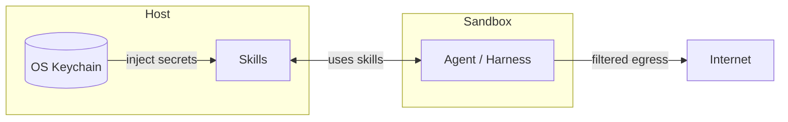

Autonomous AI coding agents are powerful but risky: without constraints, an agent can read any file on your machine, make arbitrary network requests, and use credentials it finds along the way.

omac runs the agent inside an OS sandbox that enforces three boundaries:

- **Network isolation**: all outbound traffic goes through omac's proxy. Connections to unknown hosts trigger a prompt so you can allow or deny them explicitly. In CI or headless environments, unknown hosts are denied by default.
- **Filesystem isolation**: the agent only sees your working directory and a small set of required toolchain paths. SSH keys, cloud credentials, `.env` files, and other projects are denied.
- **Secrets isolation**: API tokens never enter the sandbox. They are stored in your OS keychain and injected only into skill helper programs that run on the host. The agent calls these helpers through a controlled interface and never sees the actual credentials.

The result: a capable coding agent with a clear boundary.

## Architecture

The default sandbox uses security features built into the OS: Seatbelt on macOS and bubblewrap + Landlock on Linux.

## Supported harnesses and OS

omac is tested for Ubuntu 26.04 (native and WSL2), as well as for macOS 15.
Currently, the following harnesses are supported.

| Harness                        | OS                           | Install |
|--------------------------------|------------------------------|---|
| **OpenCode CLI** and **Desktop** | Linux Ubuntu 24.04, macOS 15 | `sudo npm install -g opencode-ai` ([docs](https://github.com/anomalyco/opencode)) |
| **Claude Code**                | Linux Ubuntu 24.04, macOS 15 | [Claude Code docs](https://code.claude.com/docs) |
| **Copilot**                    | Linux Ubuntu 24.04, macOS 15 | [Copilot CLI docs](https://docs.github.com/en/copilot/how-tos/copilot-cli/set-up-copilot-cli/install-copilot-cli) |
| **Codex** (experimental)       | Linux Ubuntu 24.04           | [Codex docs](https://github.com/openai/codex) |
| **Pi** (experimental)          | Linux Ubuntu 24.04, macOS 15 | [Pi docs](https://pi.dev) |
| **CodeWhale** (experimental)   | Linux Ubuntu 24.04, macOS 15 | `npm install -g codewhale` |

codex is not supported on macOS — its HTTP client is incompatible with the macOS sandbox and every model call hangs.

**OpenCode Desktop** (experimental): omac can also serve as a backend for the OpenCode Desktop GUI app, allowing multiple projects to be open simultaneously.
This is handled by `omac serve` instead of `omac start`. Desktop integration is not yet complete — see [serve mode](usage/cli.md#omac-serve) for usage.

## Glossary

| Term | Definition                                                                                                                                                                                              |
|---|---------------------------------------------------------------------------------------------------------------------------------------------------------------------------------------------------------|
| **Harness** | The AI coding agent that omac runs inside the sandbox (`opencode`, `claude`, …).                                                                                                                        |
| **Skill** | A self-contained package that extends what the agent can do. It provides instructions to the agent and optionally a helper program that can call external services and securely hold their credentials. |
| **Sidecar** | A helper program that runs on your machine, outside the sandbox, and implements a skill's API. If the skill needs credentials, the sidecar holds them — the agent never sees them directly.             |
| **Facade** | The component inside omac that connects the sandbox to the skill sidecars. The agent sends requests to the facade; the facade forwards them to the right sidecar.                                       |
| **MCP server** | A tool server that a harness connects to over the Model Context Protocol to gain extra capabilities (example: an MCP server can provide information on demand).                                         |

## Known limitations

- **Gradle needs `--no-daemon`.** Gradle's daemon communicates over a random
  loopback port that the sandbox blocks, so the default `gradle build` /
  `gradle test` hangs. Run `./gradlew --no-daemon` (or set
  `org.gradle.daemon=false`); see
  [troubleshooting](./troubleshooting.md#gradle-build-hangs-or-cannot-reach-its-daemon).
- **Docker is not available inside the sandbox.** The sandbox does not expose the
  Docker daemon, so anything that needs it — `docker` commands, Testcontainers-based
  tests, etc. — fails, regardless of language.

## Security model

For the full threat model, isolation mechanics, and what the sandbox can still access, have a look at [security.md](security.md).
